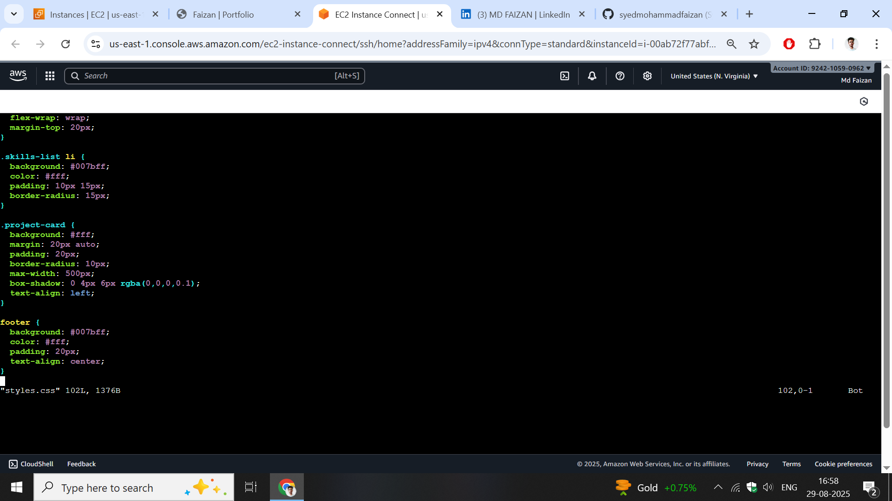

#  Static Portfolio Website with Nginx & Docker  

This is my personal **Portfolio Website** built using **HTML + CSS**, deployed inside an **Nginx web server** running in a **Docker container**.  

---

##  Project Overview  
- Built a **static portfolio** website using HTML & CSS.  
- Used **Nginx** as the web server.  
- Packaged the app inside a **Docker container** for easy deployment.  
- Exposed the website on a custom port to access from browser.  

---

## 🛠️ Tech Stack  
- **HTML5**  
- **CSS3**  
- **Nginx**  
- **Docker**  

---

## ⚙️ How to Run  

1️⃣ Clone this repository  
```bash
git clone https://github.com/<your-username>/<repo-name>.git
cd <repo-name>
